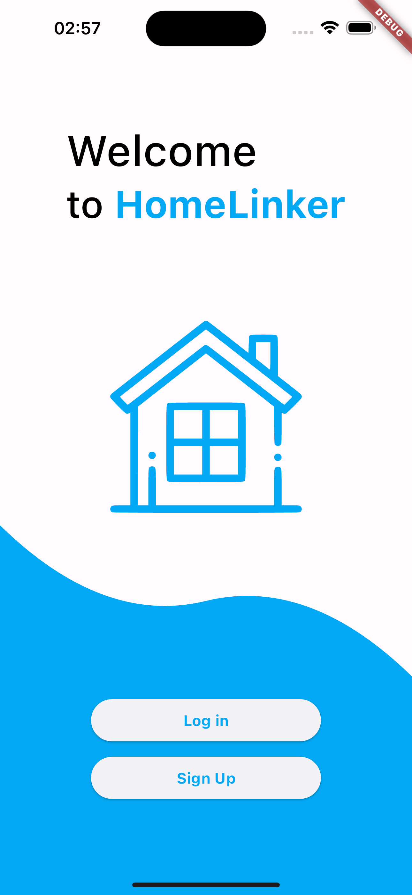
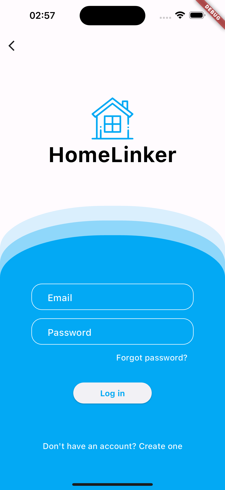
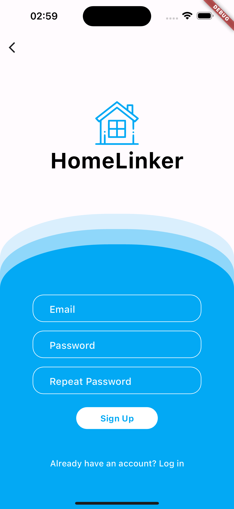
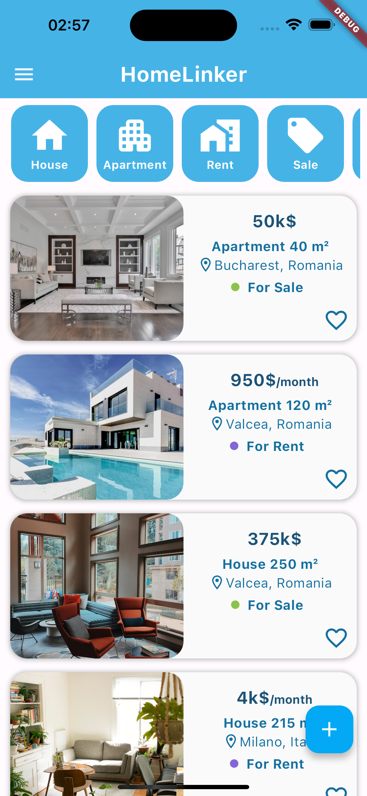
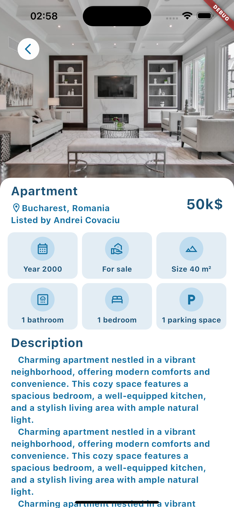
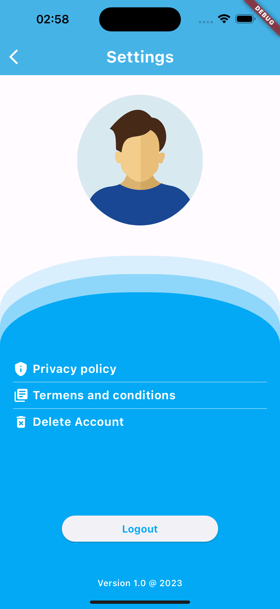
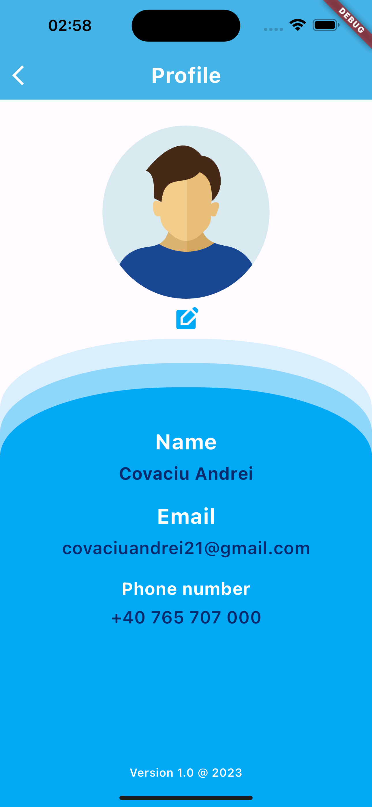
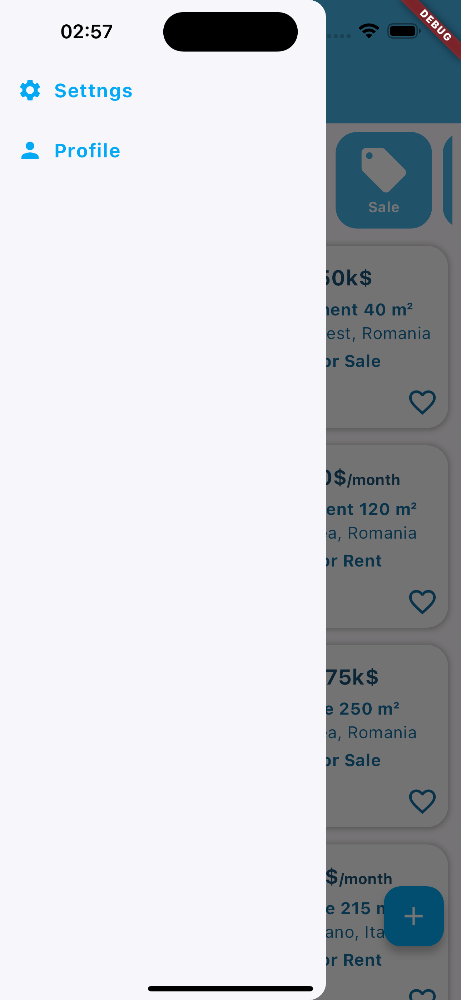
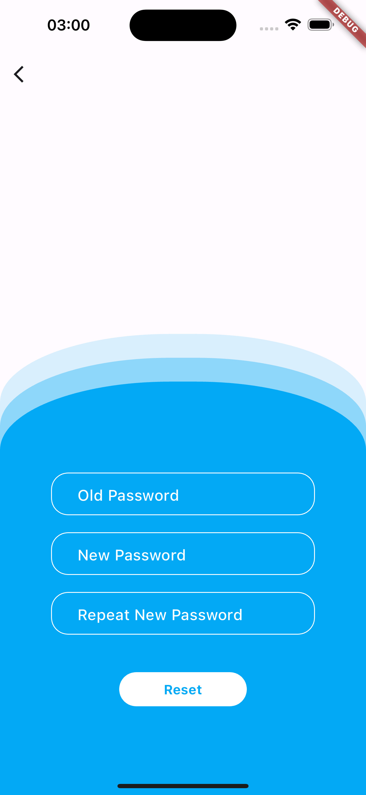

# HomeLinker

A real estate mobile application Flutter project.

## Getting Started

This project will be a Flutter application for both android and ios devices where you can list and see appartments or homes.

This main features this app will have are:
- applocalizations for making the app available in both english and romanian
- navigation between pages with AutoRouter
- bloc cubit for state management
- a script for regenerating the files

